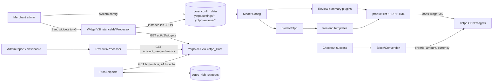
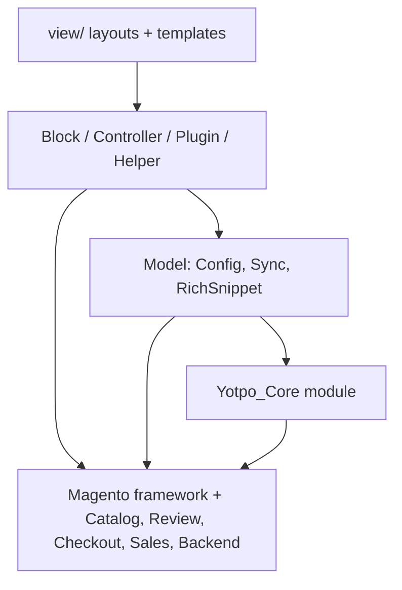

# Architecture

## System Overview
`Yotpo_Reviews` is a Magento 2 module that runs inside a merchant's Magento installation. It has no server of its own: it adds blocks, templates and plugins that put Yotpo's JavaScript widgets on storefront pages, a conversion pixel on the order success page, and Yotpo report pages in the admin. Credentials, the HTTP client, logging and the `yotpo_core` admin section come from the `Yotpo_Core` module (`yotpo/module-yotpo-core`), which this module extends and requires at the exact same version [1].

## Module Map
| Module | Responsibility | Key Files | Owner |
|--------|---------------|-----------|-------|
| Config | Every config path and Yotpo endpoint this module adds; the v3 widget-instance lookup | `Model/Config.php` (extends `Yotpo\Core\Model\Config`) | Orbits |
| Storefront widgets | Render the reviews, star-rating, Q&A, carousel, promoted-products and reviews-tab widgets | `Block/Yotpo.php`, `view/frontend/layout/default.xml`, `view/frontend/templates/*.phtml` | Orbits |
| Review-summary plugins | Replace Magento's review summary / tab with Yotpo star ratings, or hide it (MDR) | `Plugin/AbstractYotpoReviewsSummary.php`, `Plugin/Catalog/**`, `Plugin/Review/**`, `etc/di.xml` | Orbits |
| Conversion tracking | Send order id, subtotal and currency on checkout success | `Block/Conversion.php`, `view/frontend/templates/conversion.phtml`, `view/frontend/layout/checkout_onepage_success.xml` | Orbits |
| Admin reporting | Marketing → Yotpo Reviews report, dashboard tab, external redirects to Yotpo | `Controller/Adminhtml/{Report,Dashboard,External}/**`, `Block/Adminhtml/{Report,Dashboard}/**`, `Model/Sync/Reviews/Processor.php`, `etc/adminhtml/menu.xml` | Orbits |
| Widget v3 sync | Admin button that fetches v3 widget instance ids from Yotpo into config | `Controller/Adminhtml/SyncWidgetV3InstanceIds/Index.php`, `Model/Sync/WidgetV3InstanceIds/Processor.php`, `Block/Adminhtml/System/Config/SyncWidgetV3InstanceIdsButton.php` | Orbits |
| Rich snippets | Cache product bottomline (average score, review count) for 24 h in `yotpo_rich_snippets` | `Model/Sync/RichSnippets.php`, `Model/RichSnippet.php`, `Model/ResourceModel/**`, `Helper/RichSnippets.php`, `etc/db_schema.xml` | Orbits |
| Theme helpers | Public API for merchant themes to render a widget in any template | `Helper/Data.php` | Orbits |
| MFTF tests | Functional tests Adobe runs at Marketplace review | `Test/Mftf/**` | Orbits |

## Data Flow

The module never stores reviews. The storefront renders placeholder `div`s with product data attributes, and Yotpo's JavaScript fills them in the shopper's browser. Server-side API calls happen only in the admin (report, dashboard, widget sync) and in the rich-snippet cache.

## Key Abstractions
- `Model\Config` extends core's config: it merges `$reviewsConfig` and `$reviewsEndPoints` into the core arrays in its constructor (`Model/Config.php:96-97`), so every config read goes through `getConfig('<key>')` and every endpoint through `getEndpoint('<key>')`.
- v2 vs v3 widgets: a widget renders v3 markup (`yotpo-widget-instance` + `data-yotpo-instance-id`) only when `v3_enabled` is on **and** an instance id for that widget type was synced (`Block/Yotpo.php:503`, `Model/Config.php:386`). Otherwise the template falls back to v2 markup, or renders nothing for v3-only widgets (carousel, promoted products, reviews tab).
- `isEnabled()` = core's `yotpo_core/settings/active` plus app key and secret set (`Block/Yotpo.php:61`). Every template returns early when it is false; layout blocks are also guarded by `ifconfig="yotpo_core/settings/active"`.
- API calls go through `Model/Sync/Main.php:37` → core's `Yotpo\Core\Model\Api\Sync::syncV1`; `AbstractJobs` (core) supplies store emulation for per-store calls.

## Extension Points
- New widget: a config flag (`etc/config.xml`, `etc/adminhtml/system.xml`, `Model/Config.php`), `isRender*()` / `get*InstanceId()` / `isV3*Widget()` on `Block/Yotpo.php`, a template, and a block in `view/frontend/layout/default.xml`.
- New admin page: a route under `yotpo_reviews` (`etc/adminhtml/routes.xml`), a controller in `Controller/Adminhtml/`, an ACL resource in `etc/acl.xml` and a menu entry in `etc/adminhtml/menu.xml`.
- New Yotpo endpoint: add it to `$reviewsEndPoints` (`Model/Config.php:57`) and call it through `Model/Sync/Main`.
- New interception of a Magento block: a plugin class under `Plugin/<MagentoModule>/...` and a `<type>` entry in `etc/di.xml` (storefront) or `etc/adminhtml/di.xml` (admin only).

## Boundaries
- This module must not re-implement what core owns: credentials, the HTTP client, the logger base class, store emulation, the `yotpo_core` section. Extend the core class instead.
- Templates must not call the Yotpo API; server-side calls live in `Model/Sync/`.
- `Yotpo_Core` must never depend on `Yotpo_Reviews`: core installs without reviews (commit `a7515e5` moved `yotpoDisableSuite` here for that reason).

## Dependency Graph

**Forbidden imports:**
- `Model/**` must not depend on `Block/**` or `Controller/**` (the one existing exception is `Model/Config.php:17` using `ReviewRenderer` constants from Magento, not this module).
- Nothing in `Yotpo_Core` may reference `Yotpo\Reviews\*`.

## Domain Ownership

| Domain | Owner | Models | Workers/Jobs | Key Invariants | Known Fragility |
|--------|-------|--------|--------------|----------------|-----------------|
| Reviews widgets | Orbits | `Model/Config`, `Block/Yotpo` | none (no cron in this module) | A template renders nothing unless Yotpo is active and the app key and secret are set | v3 markup silently falls back when the instance-id sync was never run |
| Rich snippets | Orbits | `RichSnippet`, `yotpo_rich_snippets` | none (lazy, on read) | One row per product and store, valid until `expiration_time` | API errors are logged and return zeros |
| Admin reporting | Orbits | `Sync/Reviews/Processor` | none | Metrics are read live from Yotpo on page load | A failed call shows `-` values, not an error |

## Cross-Domain Flows

### Storefront widget render
**Trigger:** any storefront page load.

**Execution Order:**
1. `default.xml` adds the widget blocks when `yotpo_core/settings/active` is set (Magento layout).
2. Each template asks `Block\Yotpo` whether to render (enabled, page type, product present, v3 or v2).
3. `widget_script.phtml` adds the v3 loader (`cdn-widgetsrepository.yotpo.com`) or the v2 `widget.js`.
4. On product lists, `Plugin\...\ListProduct` / `ReviewRenderer` replace Magento's review summary with star-rating markup, or return `''` when MDR hides Magento reviews.

**Failure Modes:**
- Missing or stale v3 instance ids → v2 markup or nothing; fix with the "Sync widgets to v3" button.
- CSP blocks Yotpo hosts → widgets stay empty; `etc/csp_whitelist.xml` allows `*.yotpo.com` and `etc/config.xml` sets CSP to report-only.

### Widget v3 instance-id sync
**Trigger:** the admin clicks "Sync widgets to v3" (visible when `v3_enabled` = 1).

**Execution Order:**
1. `SyncWidgetV3InstanceIds/Index` resolves the store, website or all stores.
2. `Processor::process` emulates each store and calls `api_v2_widgets` with a `utoken`.
3. It writes `yotpo/reviews/widget_v3_instance_ids_last_sync_time`, then saves the `widget_type_name → widget_instance_id` map as JSON in `yotpo/reviews/sync_widget_v3_instance_ids_data`, or deletes it when Yotpo returns no instances.

**Failure Modes:**
- Yotpo disabled for a store → an error message for that store, others continue.
- API failure → "Store not found at API"; nothing is saved except the sync time.

### Conversion tracking
**Trigger:** the checkout success page.

**Execution Order:** `Block\Conversion` loads the last order from the checkout session and prints `yotpoTrackConversionData` (increment id, subtotal, currency) plus a `conversion_tracking.gif` `noscript` pixel.

**Failure Modes:** no order in session or no app key → nothing rendered.

## Architectural Decisions
Index of ADRs (full records live in `docs/adr/`):

| ADR | Decision | Status |
|-----|----------|--------|
| [ADR-0001](docs/adr/0001-mftf-tests-needing-a-yotpo-account-live-in-a-subfolder.md) | MFTF tests that need a live Yotpo account live in `Test/Mftf/Test/RequiresYotpoAccount/`; this module owns `yotpoDisableSuite` | Accepted |
| [ADR-0002](docs/adr/0002-release-in-lockstep-with-core.md) | Release in lockstep with `yotpo/module-yotpo-core`, pinned to the exact same version | Accepted |

## Constraints
- Performance: every storefront page runs the widget blocks' checks; keep them to config reads. Rich snippets call the Yotpo API at most once per product and store per 24 h.
- Scalability: no background jobs; all work is per request.
- Compatibility: the Composer package is public and installed by merchants across Magento 2.4.x and PHP 8.x (nullable-type fix for PHP 8.4 in commit `a59dba9`). Config paths, template names under `Yotpo_Reviews::`, the public `Helper/Data.php` methods and the `yotpo_rich_snippets` table are used by merchants' themes and data and must not change without a migration path. The code must pass Adobe's Marketplace phpcs and MFTF runs [2][3].

# Citations

[1] Version bump commit requiring core at the same version (git commit `0805255`, "Bump version to 4.3.10; require core 4.3.10")
[2] Adobe Marketplace phpcs run with `--ignore-annotations` (git commit `9730297`, "Fix phpcs errors for Adobe Marketplace submission")
[3] Adobe Marketplace MFTF run and the account-dependent tests (git commit `a63f4c2`, "Separate the MFTF tests that need a live Yotpo account")
